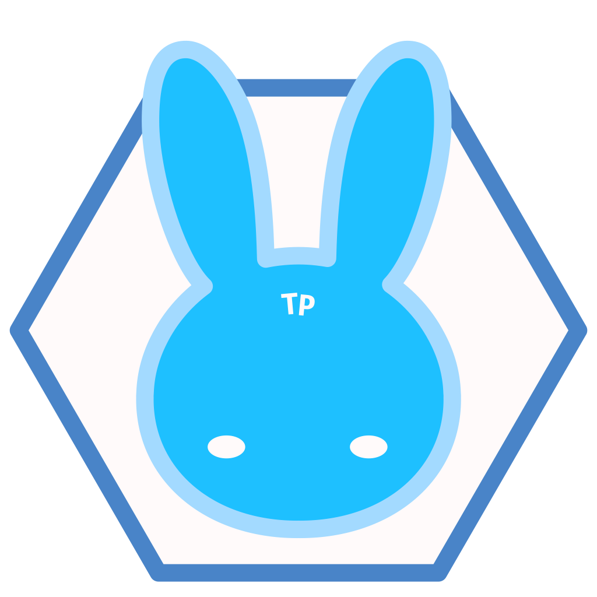

<p align="center">
    
</p>
<h1 align="center"><b>TonyaPuzzle</b></h1>

<!-- 讓網頁開發就像拼圖一樣簡單 -->
<p align="center">「讓<b>網頁開發</b>就像<b>拼圖</b>一樣<b>簡單</b>。」</p>
<p align="center"> "Make Web Development as Easy as Piecing Together a Puzzle" </p>

## 理念
讓用戶**更易上手**及**維護**網頁。  
盡量**提供**及**簡化**網頁開發所需工具。  

## 特性
1. **簡易上手**，開箱即用
2. **通用性高**，使用原生H5, CSS3, JS開發
3. **統一規範**，從代碼到組件樣式，保持美觀又可靠。
4. **響應式設計**，適應不同設備裝置。

## 項目結構
```

```

## 使用
### 下載
```
git clone https://github.com/AnsonCar/TonyaPuzzle.git
```

## 查閱更多
查看 [Change Log(更新日志)](./docs/changelog.md) 