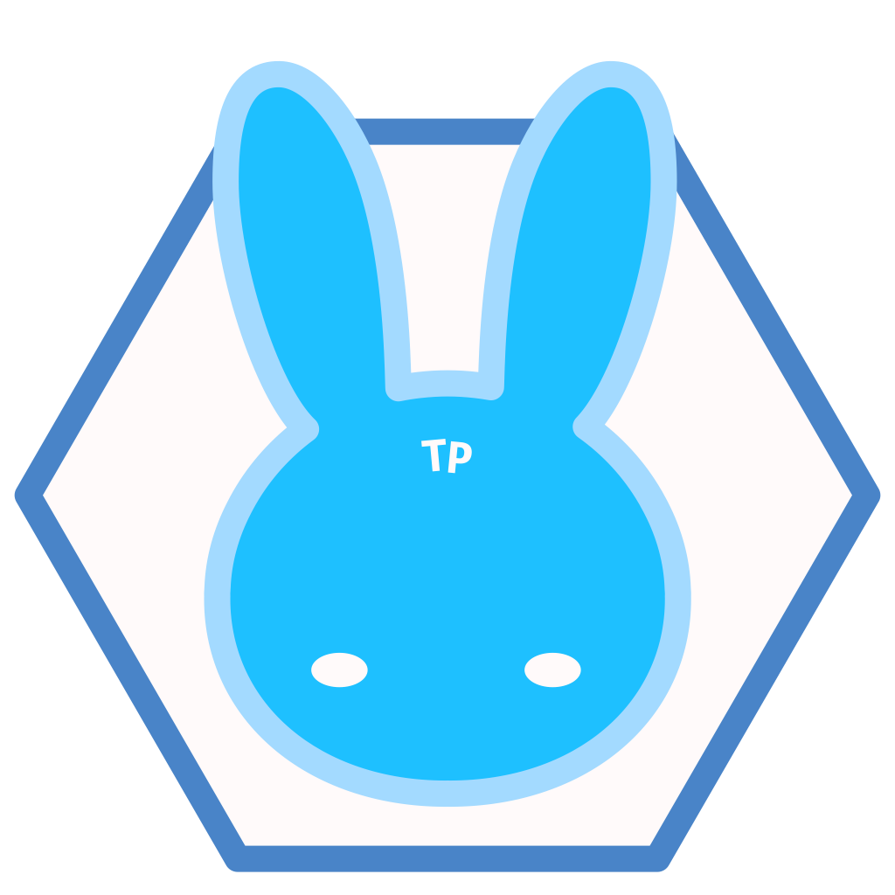

<p align="center">
    
</p>
<h1 align="center"><b>TonyaPuzzle</b></h1>

<!-- 讓網頁開發就像拼圖一樣簡單 -->
<p align="center">「讓<b>網頁開發</b>就像<b>拼圖</b>一樣<b>簡單</b>。」</p>
<p align="center"> "Make Web Development as Easy as Piecing Together a Puzzle" </p>

## 理念
讓用戶**更易上手**及**維護**網頁。  
盡量**提供**及**簡化**網頁開發所需工具。  
 
## 特性
1. **簡易上手**，開箱即用
2. **通用性高**，使用原生H5, CSS3, JS開發
3. **統一規範**，從代碼到組件樣式，保持美觀又可靠。
4. **響應式設計**，適應不同設備裝置。

## 項目結構
```
TonyaPuzzle
├── Logo
│
├── README.md
│
├── TonyaPuzzleUI 組件庫（使用vite打包）
│   ├── assets
│   └── index.html
│
├── docs 文檔
│   ├── ModuleStandard.md 組件規範
│   ├── ReferenceData 參考資料
│   ├── TonyaPuzzle.xd 
│   ├── changelog.md 開發日誌
│   ├── component.md 組件API總覧
│   └── tp-guidebook.md 組件指南
│
├── index.html 入口（開發用）
│
├── node_modules 
├── package-lock.json
├── package.json
│
├── src 源代碼
│   ├── component 組件代碼
│   ├── main.css 組件樣式
│   ├── main.js 組件.js
│   ├── style css
│   └── templateSyntax 模板語法
│
└── vite.config.js

```

<!-- ## 使用
```

``` -->

## 內容包括
### **TonyaPuzzleUI**
- UI Component (組件庫)
- 后台及前台框架/模板
### **TonyaPuzzleTX**
- Template Syntax (模板語法)

## 未來更新
- ### **TonyaPuzzle icon**
- ### **TonyaPuzzle Chart**
- ### **TonyaPuzzle (Web Builder Framework)**

## 查閱更多
查看 [使用指南](./docs/tp-guidebook.md)
查看 [組件API總覧](./docs/component.md)  

查看 [Change Log(更新日志)](./docs/changelog.md)  
查看 [參考資料](./docs/ReferenceData/ReferenceData.md)  

如果覺得本項目有潛力 或 對你有幫助，可以點Star鼓勵一下AnsonCar~